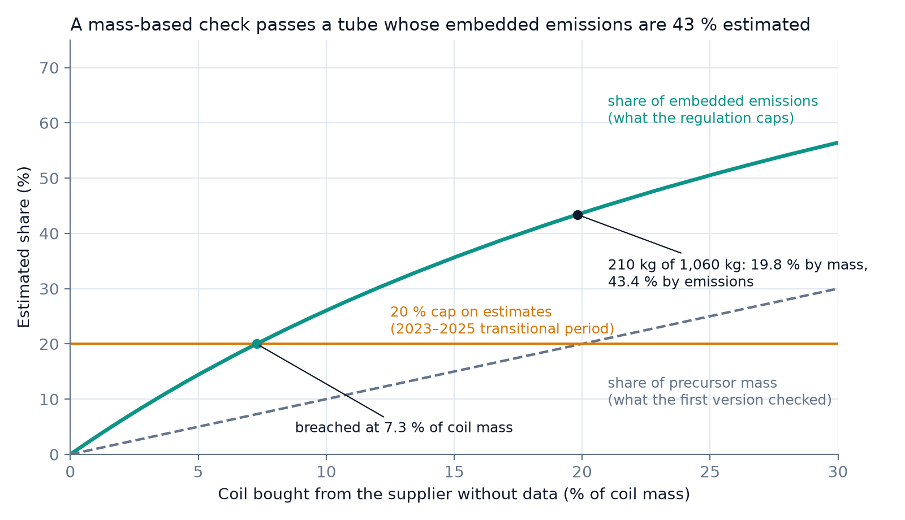
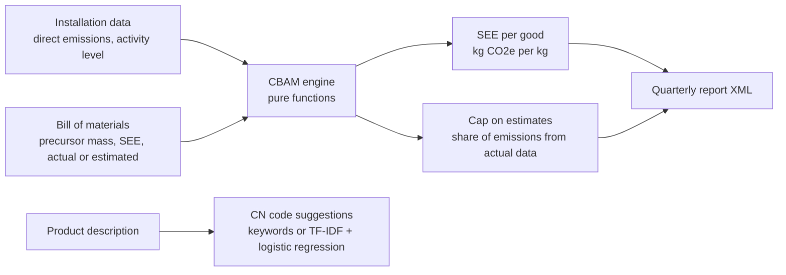

# clearborder-cbam

How much embedded CO2 does an imported steel or aluminium good carry under the EU Carbon Border
Adjustment Mechanism (CBAM), and does its data meet the 20 % cap on estimates? A tested calculation
engine, API and dashboard, built as an early prototype in spring 2026.

[](https://github.com/Pchambet/clearborder-cbam/actions/workflows/ci.yml)




> **Status.** Exploratory prototype (March 2026), reviewed and corrected in October 2026. The
> exploration narrowed to landed-cost allocation for importers, which became
> [FreightSight](https://github.com/Pchambet/freightsight-landed-cost). The project started with
> a broader landed-cost scope; only the CBAM part was built here.

## TL;DR

- **The engine** implements the specific-embedded-emissions formula of Regulation (EU) 2023/956,
  Annex IV — `SEE = (AttrEm + Σ M_i · SEE_i) / AL` — including nested bills of materials, as pure
  functions tested against hand-computed cases.
- **The 20 % cap on estimates must be measured on emissions, not on mass.** On an illustrative
  welded tube (figure above), 210 kg of 1,060 kg of coil comes from a supplier without data:
  19.8 % of precursor mass, but 43.4 % of the 1,113 kg CO2e embedded. A mass-based check passes
  it; the emissions-based check fails it. The cap is already breached once 7.3 % of the coil comes
  from that supplier.
- **The first version checked the cap on mass.** An October 2026 self-review found this and two
  crash bugs; all are fixed and covered by tests (see [Changes since the first version](#changes-since-the-first-version)).
- **81 tests, 96 % line coverage** of the application package, ruff-clean, under a minute on a laptop;
  CI also builds the Docker image.

## Why it matters

Since 1 January 2026, importers of more than 50 t a year of CBAM goods (iron and steel, aluminium,
cement, fertilisers; hydrogen and electricity regardless of mass) are liable for the carbon embedded
in what they import, settled with CBAM certificates from 2027. The number they report is built from
supplier data of uneven quality, and during the 2023–2025 transitional period Implementing
Regulation (EU) 2023/1773 allowed estimates for complex goods only up to 20 % of their total
embedded emissions. A check on the wrong denominator gives a compliance answer that looks
reassuring and is wrong, which is the failure mode a declarant cannot afford.

## Approach



1. **Data.** Installations, goods and precursors are stored in SQLite or PostgreSQL through a
   FastAPI service; a Streamlit dashboard is a thin client over it.
2. **Method.** `app/cbam_engine.py` computes SEE recursively over the bill of materials and the
   share of embedded emissions backed by actual data. Direct emissions count as actual data.
3. **Decision.** Each good gets its SEE, its actual-data share and a pass/fail on the 80/20 rule;
   the report endpoint aggregates them into a simplified quarterly-report XML.

## Results

**Worked example** (`make example`, inputs are illustrative, not Commission default values):

| | Value |
|---|---|
| Output | 1,000 kg welded tube (CN 7306) |
| Direct emissions at the tube mill (actual) | 120 kg CO2e |
| Coil from supplier A, actual SEE 0.60 | 850 kg → 510 kg CO2e |
| Coil from supplier B, estimated SEE 2.30 | 210 kg → 483 kg CO2e |
| SEE of the tube | 1.113 kg CO2e/kg |
| Estimated share by precursor mass | 19.8 % — passes a mass-based check |
| Estimated share by embedded emissions | 43.4 % — fails the cap |
| Supplier-B share of coil at which the cap is breached | 7.3 % |

Tests check the base case and the breach point against closed-form values
(`tests/test_worked_example.py`).

**API on the demo data** (`python scripts/seed_data.py`, then `POST /api/v1/generate-cbam-report`
for 10 t of hot-rolled plate made from 1,050 kg of slab at 1.6 kg CO2e/kg plus 50 kg CO2e of
direct emissions per tonne): `see_kg_co2_per_tonne = 1730.0`, `real_data_ratio = 1.0`,
`compliant_80_20 = true`, and an XML report with one `Product` line of 10,000 kg at 1.73 kg CO2e/kg.

**CN code suggestions.** Without a trained model, a keyword heuristic (English and French) ranks
six CBAM headings and returns nothing when no keyword matches; `train_classifier` fits TF-IDF +
logistic regression on labelled descriptions. Neither has been evaluated on a real labelled corpus,
so no accuracy is claimed.

## Reproduce

```bash
cd clearborder
python3 -m venv .venv && source .venv/bin/activate    # Python 3.11 to 3.14
pip install -r requirements-dev.txt
make lint test        # ruff + 81 tests, under a minute
make example          # regenerates docs/figures/estimation-cap.png and docs/worked-example.json
./run.sh              # API on :8000 and dashboard on :8501 with demo data
```

No external data is downloaded; the demo data and the CN sample are in the repository.
Developer notes, endpoints and configuration: [clearborder/README.md](clearborder/README.md).

## Repository layout

```
.
├── clearborder/
│   ├── app/
│   │   ├── cbam_engine.py     # SEE and cap on estimates (pure functions)
│   │   ├── classifier.py      # CN code suggestions
│   │   ├── xml_generator.py   # report XML, structural and XSD validation
│   │   ├── services.py        # glue between API, database and engine
│   │   └── main.py, routes.py, models.py, schemas.py, config.py, auth.py, database.py
│   ├── dashboard/app.py       # Streamlit client
│   ├── scripts/               # demo data, CN loader, worked example
│   ├── data/cn_codes_sample.json
│   ├── tests/                 # engine, API, services, XML, classifier, dashboard
│   └── Dockerfile, docker-compose*.yml, Makefile, run.sh
└── docs/                      # README figure and worked-example numbers
```

## Methodology notes and limitations

- **Transitional-period rule.** The 20 % cap is the rule of the 2023–2025 transitional period
  (until mid-2024 a broader use of default values was also tolerated). The definitive period that began on 1 January 2026 has its own provisions on actual versus
  default values, which this prototype does not model.
- **Data quality is binary per precursor.** A precursor is either actual or estimated; partially
  documented precursors, and the data quality of nested bills of materials, are not propagated.
  A precursor with neither an SEE nor a nested bill of materials is rejected (`ValueError`) rather
  than dropped, since dropping it would understate embedded emissions.
- **Not the official format.** The report XML uses a project namespace and a simplified structure.
  It is not the CBAM Registry XSD and would be rejected by it; the XSD hook only validates against
  a schema you provide.
- **No default-value lookup.** The default-factor table holds illustrative numbers and is not used
  by the engine; estimated SEE values must be supplied by the user. Indirect emissions, carbon price
  paid in the country of origin and CBAM certificate costs are out of scope.
- **Classifier unevaluated.** See above; suggestions need review by a customs specialist.
- **Prototype engineering.** No migrations (`create_all`), permissive CORS, optional API keys,
  and no deployment configuration; the Cloud Run workflow of the first version was removed because
  it never had credentials and failed on every push.

### Changes since the first version

An October 2026 self-review found three defects the original tests did not catch: the cap was
checked on precursor mass instead of embedded emissions; the documented `API_KEYS="k1,k2"` setting
crashed the app at start-up; and the dashboard's report page crashed whenever a report was
generated. The same round fixed error handling (API errors were shown as "API unavailable" or as
empty lists), stopped silently dropping precursors without data, and updated the January 2024
dependency pins so the app installs on Python 3.11 to 3.14.

## References

- Regulation (EU) 2023/956 establishing a carbon border adjustment mechanism, Annex IV —
  <https://eur-lex.europa.eu/eli/reg/2023/956/oj>
- Regulation (EU) 2025/2083 amending Regulation (EU) 2023/956 (simplification: 50 t annual
  threshold, certificate timetable) — <https://eur-lex.europa.eu/eli/reg/2025/2083/oj>
- Commission Implementing Regulation (EU) 2023/1773 (reporting obligations during the transitional
  period) — <https://eur-lex.europa.eu/eli/reg/2023/1773/oj>
- European Commission, default values for the transitional period (December 2023) —
  <https://taxation-customs.ec.europa.eu/news/commission-publishes-default-values-determining-embedded-emissions-during-cbam-transitional-period-2023-12-22_en>

---

Built by [Pierre Chambet](https://github.com/Pchambet) — decision science for operations under uncertainty.
